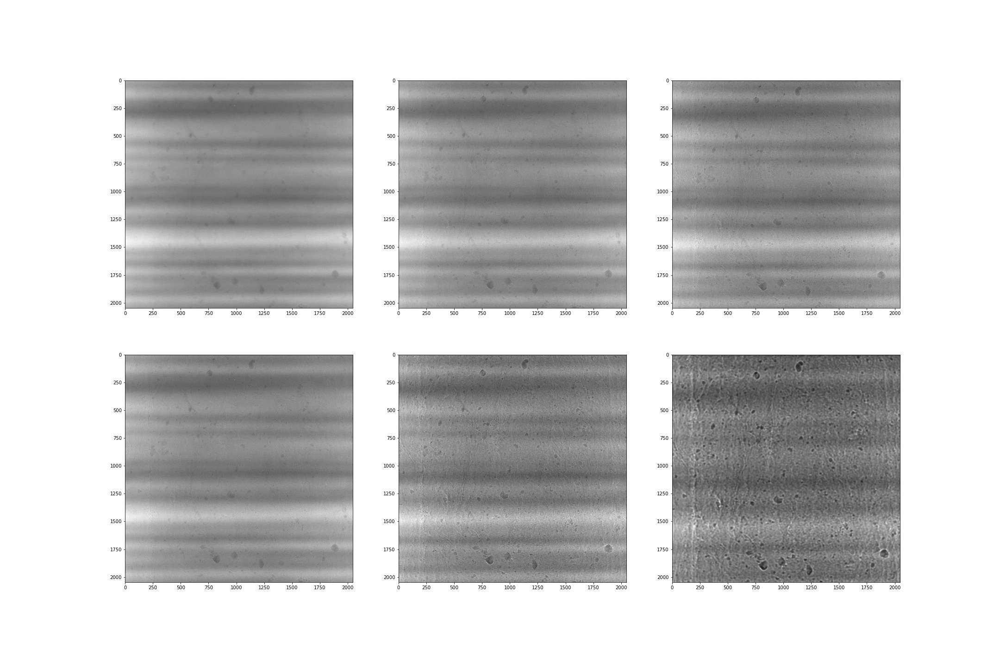
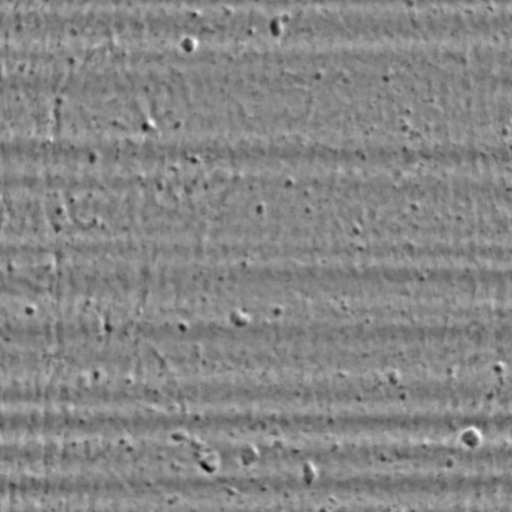
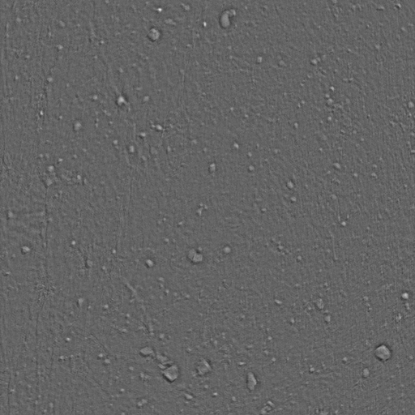

## Multidistance CFT phase retrieval

[\\]: # (FIX THE paths in the examples)
This examples covers the usage of pyPhase for phase retrieval using CTF on a real dataset. 

The images are is in `tiff` format and are not preprocessed.  

[Install](install.md) pyPhase. Then:
~~~python
from pyphase import dataset
from pyphase import phaseretrieval
from pyphase import utilities 

import matplotlib.pyplot as plt # for visualization purposes
from skimage import io
~~~
#### Dataset setup

Define the projects name
~~~python
name = 'safold'
~~~
and set the path to the data
~~~python
path = '/data/staff/tomograms/safold'
~~~

Make sure that the data folders and files have the right [format and structure](structure.md).

You can have a look at the data 

~~~python
fig, ax = plt.subplots(nrows = 2, ncols = 3, figsize = (30,20))

for i,row in enumerate(ax):
    for j,col in enumerate(row):
        file = '/data/staff/tomograms/users/diogo/Data/safold/safold_{}_0040.tif'.format((i+1)*(j+1))
            
        im = io.imread(file)
        col.imshow(im, cmap='gray')
~~~

pyPhase will look the [parameter](structure.md#parameterfile) in the projects information  files.

By default, it will include all the projections' distances found, which will be used for the phase retrieval.
If you wish to use only some of the distances you may edit the file and change it according to your specifications.

[\\]: # (note that it will go to the folders in order, )

Create the DataSet object
~~~python
ds = dataset.TiffDataSet(path,name)
~~~
[\\]: # (more about dataset here?)

To have pyPhase perform flat-field correction and do shifts correction set

#### Preprocessing

~~~python
ds.preprocess=1
ds.correct_shifts=1
~~~
and set
~~~python
ds.correct_motion = 0
~~~

Use the utilities module to choose a registration algorithm

~~~python
RA = utilities.ElastixCorrelationRegistrationAlgorithm()
~~~

Observe that using utilitie requires having elaxtix installed.

To get the shifts run

~~~python
ds.Align(RA, interval = 8)
~~~

where interval is the number of projections in between the images to align. This create a file shifts.picle, in containing the shifts. These then fit into a polynomial using

~~~python
ds.FitShifts()
~~~
>Note:
>
> *Magnification correction is not yet implemented.*

#### Phase retrieval

At this stage we can create our CTF retriever object with

~~~python
alpha = 1e-8
retriever = phaseretrieval.CTF(ds, alpha)
~~~
*Refere to the [API](api.md) for other phase retrieval algorithms available in pyPhase.*

Choose the range of projections to which to apply the phase retrieval

~~~python
start = 26
end = 27
~~~
Retrieve the phase with
~~~python
retriever.ReconstructProjections(ds, start, end)
~~~

For each projection, a file named `safold_[version_prefix]_00[n].tif` with the retrieved phase and and file
 named `safold[version_prefix]_att__00[n]`, with the retrieved attenuation, 
 is created in */data/staff/tomograms/safold_*.

#### Visualizing the results

Look at the results by plotting the retrieved phase and retrieved attenuation for one projection

~~~python
plt.figure(figsize = [8,8])
im = io.imread(path + 'safold_/safold_PP_0026.tif')
plt.imshow(imm, cmap = 'gray')
~~~

~~~python
plt.figure(figsize = [8,8])
im = io.imread(path + 'safold_/safold_PP_att_0026.tif')
plt.imshow(imm, cmap = 'gray')
~~~

