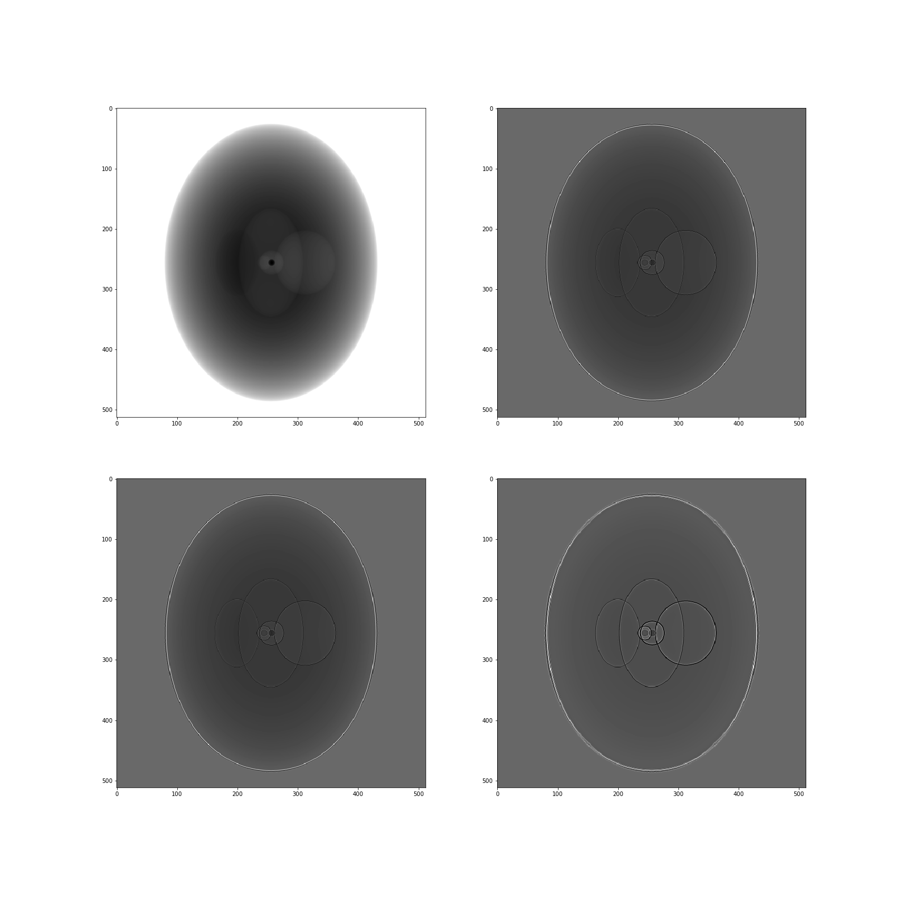
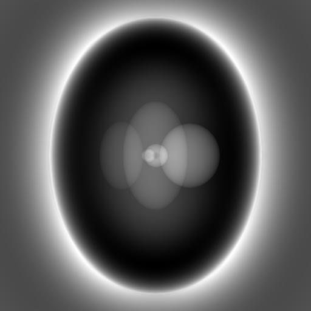
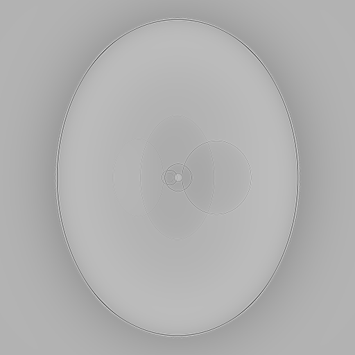

## Multidistance CFT phase retrieval

This notebook runs an example of multi-distance CTF phase retrieval on simulation data in `edf` format.

[\\]: # (FIX THE paths in the examples)


Multi-distance CTF Phase Retrieval

This notebook runs an example of multi-distance CTF phase retrieval on simulation data in edf format.

NOTE: If using unrealeased version of pyPhase, have the source files in the python projects directory and change pyphase inmport to import.

Creating a Conda enviornment for this notebook.

```bash
conda create --name pyPhaseEnv --channel conda-forge python=3.7 numpy yaml sortedcontainers
source activate pyPhaseEnv
```


Make sure pyPhase source code is in the systems path so that the modules can be imported.

~~~python
import os
import sys

pyphase_path_1 = os.path.abspath('/home/diofig/tomograms/users/diogo/Python/latest/pyPhase/')
pyphase_path_2 = os.path.abspath('/home/diofig/tomograms/users/diogo/Python/latest/')
sys.path.append(pyphase_path_1)
sys.path.append(pyphase_path_2)
~~~


#### Dataset setup

[Install](../install.md) pyPhase. Then:
~~~python
from pyPhase import dataset
from pyPhase import phaseretrieval

from EdfFile import EdfFile # for visualization
import matplotlib.pyplot as plt
~~~
Define the project's name
~~~python
name = 'holosim'
~~~
and set the path to the data
~~~python
path = '/data/staff/tomograms/users/diogo/Data/HoloSim'
~~~

Make sure that the data folders and files have the right [format and structure](../Data_Layout.md).

You can have a look at the data 

~~~python
fig, ax = plt.subplots(nrows = 2, ncols = 2, figsize = (22, 15))

for i,row in enumerate(ax):
    for j,col in enumerate(row):
        file = '/home/d/PhasingProj/Data/HoloSimT/holosimt_{proj}_/holosimt_{proj2}_0001.tif'.format(proj=(i+1)*(j+1),proj2=(i+1)*(j+1))
        im = io.imread(file)
        col.imshow(im, cmap='gray')
~~~



Create a DataSet object
~~~python
ds = dataset.ESRFID19(path,name)
~~~
[\\]: # (more about dataset here?)

#### Phase retrieval

Choose a phase retreival algorithm(link to list of algorithms) and create a retriever for the dataset, with the appropriate arguments 
~~~python
alpha =  1e-8
retriever = phaseretrieval.CTF(ds,alpha)
~~~
Select range of projections for which to retrieve phase
~~~python
start = 0 
end = 3 
~~~
Run the phase retreival
~~~python
retriever.ReconstructProjections(ds, start, end)
~~~
For each projection, a file named `holosim_[version_predix]_000[n].edf` with the retrieved phase and and a file named `holosim_att__000[n].edf`, with the retrieved attenuation, is created in the `[path]/myProject_`


#### Visualizing the results

Look at the results by plotting the retrieved phase and retrieved attenuation for one projection

~~~python
plt.figure(figsize = [8,8])
im = io.imread(path + 'holosim_/holosim_PP_0001.tif')
plt.imshow(imm, cmap = 'gray')
~~~


~~~python
plt.figure(figsize = [8,8])
im = io.imread(path + 'holosim_/holosim_PP_att_0000.tif')
plt.imshow(imm, cmap = 'gray')
~~~


